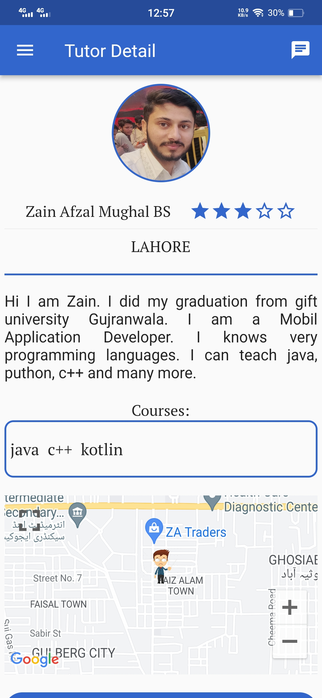

# tutor360

This is a Tutor Finder Application.

Users are as follows:

-Admin

-Tutor

-Student

 **Functionality**
FR-01 System shall provide the facility to the student to sign up by OTP verification.

FR-02 System shall provide the facility to the tutor to sign up by OTP verification.

FR-03 System shall provide the facility to the student to show the login page.

FR-04 System shall provide the facility to the tutor to show the login page.

FR-05 System shall provide the facility to the tutor to enter a username.

FR-06 System shall provide the facility to the student to create a username.

FR-07 System shall be able to display success messages after entering valid OTP code.

FR-08 System shall provide the facility to the student to add profile pictures.

FR-10 System shall provide the facility to the tutor to update their profile picture.

FR-11 System shall provide the facility to the student to update their profile picture.

FR-12 System shall provide the facility to the tutor to update the username.

FR-13 System shall provide the facility to the student to update the username.

FR-14 System shall provide the facility to the tutor to upload their latest degree
Pictures.

FR-15 System shall provide the facility to the tutor to add ID card pictures.

FR-29 System shall provide the facility to the students to pay their fees to thetutors via jazz cash API.

FR-30 System shall provide the facility to the admin to view tutor’s feedback.

FR-31 System shall provide the facility to the tutors to receive payment from the students.

FR-32 System shall provide the facility to the student to give feedback to the tutor after paying the fee.

FR-33 System shall provide the facility to the students to rate the tutors after paying there.

FR-34 System shall provide the facility to the tutor to view feedback given by the students.

FR-35 System shall provide the facility to the tutor to view the ratings givenby the students.

FR-36 System shall provide the facility to the student to see the tutor profile.

FR-16 System shall provide the facility to the tutor to select courses.

FR-17 System shall provide the facility to the students to search the tutors by course.

FR-18 System shall provide the facility to the students to search the tutors by location.

FR-19 System shall provide the facility to the student to search the tutors by name.

FR-20 System shall provide the facility to the student to search the tutors by
Rating.

FR-21 System shall provide the facility to students to show search bar.

FR-22 System shall provide the facility to students to show search buttons.

FR-23 System shall provide the facility for the students to send messages to thetutors.

FR-24 System shall provide the facility to the student to show the Chabot activity.

FR-25 System shall provide the facility to the tutor to show the chat box activity.

FR-26 System shall provide the facility to the students to receive messages
from the tutors

FR-27 System shall provide the facility to the tutor to receive messages from the
Student.

FR-28 System shall provide the facility to the tutor to send messages to the student.

FR-37 System shall provide the facility to detect fake reviews.

System shall provide the facility to remove fake reviews.

FR-38 System shall allow the students to report a tutor.

FR-39 System shall allow the tutors to report a student.

FR-40 System shall provide facility to admin to login.

FR-41 System shall provide facility to admin to see all tutor profiles which applied for registration.

FR-42 System shall provide facility to admin to approve tutor account request.

FR-43 System shall provide facility to admin to reject tutor account request.

FR-44 System shall provide a facility to the admin to see reports of users.

FR-45 System shall provide a facility to the admin to change his/her password.

FR-46 System shall provide the facility to the admin to view tutor’s saved location.

FR-47 System shall provide the facility to the admin to create new admin account.

FR-48 System shall provide the facility to the admin to view all tutors.

FR-49 System shall provide the facility to the admin to view all students

FR-50 System shall provide the facility to the admin to block student.

FR-51 System shall provide the facility to the admin to block tutor

FR-52 System shall provide the facility to the admin to unblock students

FR-53 System shall provide the facility to the admin to unblock tutors

FR-54 System shall provide the facility to the admin to send message to tutor
During account approval process

FR-55 System shall provide the facility to the admin to edit tutor’s profile.

FR-56 System shall provide the facility to the admin to view tutor’s rating.

FR-57 System shall provide the facility to the admin to view tutor’s feedback.

FR-58 System shall be able to send notification to the blocked Tutor’s.

FR-59 System shall be able to send notification to the blocked Students’.

FR-60 System shall be able to show account creating in progress message
after the tutor fills the registration form.

FR-61 System shall provide the facility to the tutor to write a description about him.

FR-62 System shall provide the facility to the student to search tutor by username.

FR-63 System shall provide the facility for to tutor to view his/her description.

FR-64 System shall provide the facility for the tutor to view /her profile.

FR-65 System shall provide the facility to the students to view /her profile.

FR-66 System shall provide the facility for students to log out.

FR-67 System shall provide the facility for tutors to log out.

FR-68 System shall provide the facility to tutors to save their location.

FR-69 System shall provide the facility to the student to view tutor’s saved location.

FR-70 System shall the facility to tutors to show message notifications.

FR-71 System shall the facility to students to show message notifications.

FR-72 System shall provide the facility to tutor to view a list of paid students.

FR-73 System shall provide the facility to the tutor to select courses from the given list.

**Here are some Screenshots by Student role.**

**Tutor Search page for student:**

**Student can search by**

**System Autorecommend Tutors based on you Courses Interest**

**Student can visit tutor profile,courses location**

**Student can visit tutor's feedbacks rating**

**"full view"**

**Student can Report Tutor profile**

**Readtime Chatting with tutor**

**Tutors near to you with distance count**

